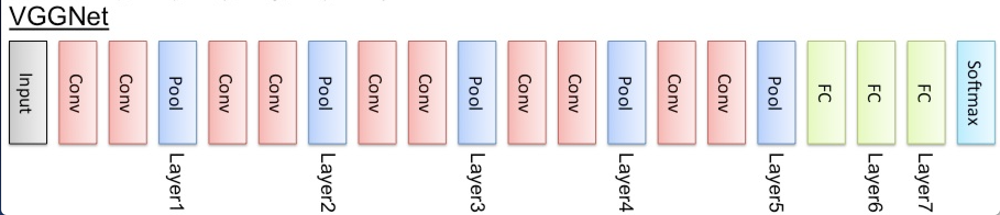
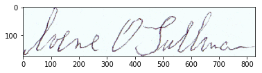
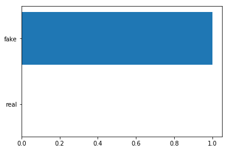

## Offline Signature Verification System

## Group Member
Chenghong Lin ([chenghonglin2020@u.northwestern.edu](mailto:chenghonglin2020@u.northwestern.edu))

Xiangguo Liu ([xg.liu@u.northwestern.edu](mailto:xg.liu@u.northwestern.edu))

## Abstract
### Task
Given a library of handwritten signatures with genuine or fake labels, our task is to use machine learning techniques to tell whether a signature is real or fake by the offline signature image.

### Motivation
There are two reasons why we are interested in this task. Firstly, nowadays the world is in the age of information, our signature can be easily stolen by potential criminals. Then they can make fake signatures. Usually, we just distinguish whether it’s fake or real manually which it’s very time-consuming and its accuracy is not very high. Different people may even give different answer. So, we want to apply the machine learning knowledge to build a handwritten signature classification system to judge whether the signature is fake or not. Secondly, we decide to focus on the offline handwriting verification process. Because Offline verification can be used in information-limited situation and is considered to be the harder case.

### Approach
We adopted three methods (K-Nearest Neighbor, Neural Networks, Support Vector Machine) to solve this problem. At first, pixel values of images are extracted as features to be used in KNN(pixel), however, this accuracy is pretty low, it only gets about 17% accuracy. Next, we tried to use transfer learning to extra features of the images. And VGGNet is utilized to get new representative features of the images. Then these new features are used in KNN(vgg), NN and SVM. 80% dataset is utilized as the training dataset, 10% is validation dataset, and the remain 10% is test dataset. Neural Networks provides the best performance, its accuracy is 94.77%. Use VGG representation is considered to have better performance than pixel representation. **As we are processing the images, so the most important feature is the feature of the image.?**

## Results
The results show the model accuracy based on different methods. **Insert TABLE!!!*

And after we trained the network, it can output the accuracy and predict whether this image is real or fake.

## Related Work
### Dataset Cleaning
We obtaint the dataset from ICDAR 2011 Signature Verification Competition. The whole dataset contains the signatures of 67 persons. Each person has 12 real and fake images. At first, our dataset is a bit messy, and we spent some time on cleaning the data and make each images to have the correct label.

### Features Extraction
At first, we just simply extract the pixel value of each image and calculate the pixel difference between each image. However, the result is bad, we only get 17% accuracy on nearest neighbor algorithm. Thanks to Prof. Downey, after talking with him, we found that we can use transfer learning to extract the features of our images, and after that we can build our own classifier on top of that.

The architecture of VGG Network is shown below. It contains 4 convolutional layers, 3 fully connected layers and softmax output layer, the hidden layer uses ReLU activation function. Because VGG Network is a good feature extractor, so the idea in our project is that we uses VGG Network to extract the feature of the raw images, and get the feature vector of these images.

     
    <i>VGGNet Architecture</i>

### Methods
In this project, we applied three training methods: K Nearest Neighbor, Neural Networks, Support Vector Machine.

- **K Nearest Neighbor (pixel value representation)**
  
  At first, we just manually extract the pixel values of the grayscale images and convert the whole matrix into a vector, and for each image in the test dataset, we try to find the image which has the minimun L1 distance in the training set, and finally we only got 17% accuracy which is pretty low.

  After that, we tried cosine_similarity on nearest neighbor. Since we don’t care the exact gray value of each pixel and only want to contrast the value for white and black point, we form a new matrix whose elements are all “0” or “1”. For pixel scale value that is larger than 127, the corresponding value is 0; otherwise it’s 1. Inspired by homework4, we tried cosine similarity to measure the distance of pictures, the accuracy we got is 50%.

- **K Nearest Neighbor (VGG representation)**
  
  Because raw pixel representation doesn't extract feature of the image very well, so we first put all training and test dataset images to the VGG Network, and get the feature vectors. Then we just use the L1 distance (Manhattan distances) and L2 distance (Euclidean distances) to calculate the nearest neighbor. This time, the accuracy was much better, it got 84.26% for both L1 and L2 distance. And when we try K=3 and assign the majority of the 3 nearest neighbors' class label to this test image, it got accuracy a bit lower, with 82.95%.

- **Neural Networks**
  
  With our images being converted as feature vector, we use it as the input for our network, each of them are 4096D vectors. And we also one-hot encoding our labels to become 0 and 1 as there are just two classes in our dataset. We use softmax activation function for our output layer, and use cross entropy to calculate the cost while use Adam as our optimizer. And finally we got 94.77% accuracy on the test dataset, which is the best test accuracy we got on all of the model we have tried so far.
  
  Below is the example picture that we tried to predict the image's output label, that's whether is real or fake.
  
  

     
    <i>Input Image</i>
  
  
  
  

     
  <i>Predict Result</i>
  

  
  
- **SVM**
  
  The features that we used in SVM is also feature vector. Because we want to achieve binary classification in this project, so we just assign -1 to 'fake' label and 1 to 'real' label. And we use Hinge Loss as our loss function. Finally we got 81.67% accuracy on test dataset.
  
  **insert equation & can be more specific**
  

## Conclusion & Future Works

At beginning, we just train the model on a small part of the dataset, and we found that the model accuracy is not very high, and it seems that the nearest neighbor got the highest accuracy compared to neural networks. However, when we increased the training dataset and feed more images to the network, it seems that it got better, and reach 94.77% accuracy. 

Because for the limit of the time, we didn't try enough machine learning algorithms, and I think that's will be our major future works. For example, we could still try to use Boosting algorithm to classify the images. And we can also try to use other CNN models, e.g, AlexNet, GoogleNet, and see what happens.
